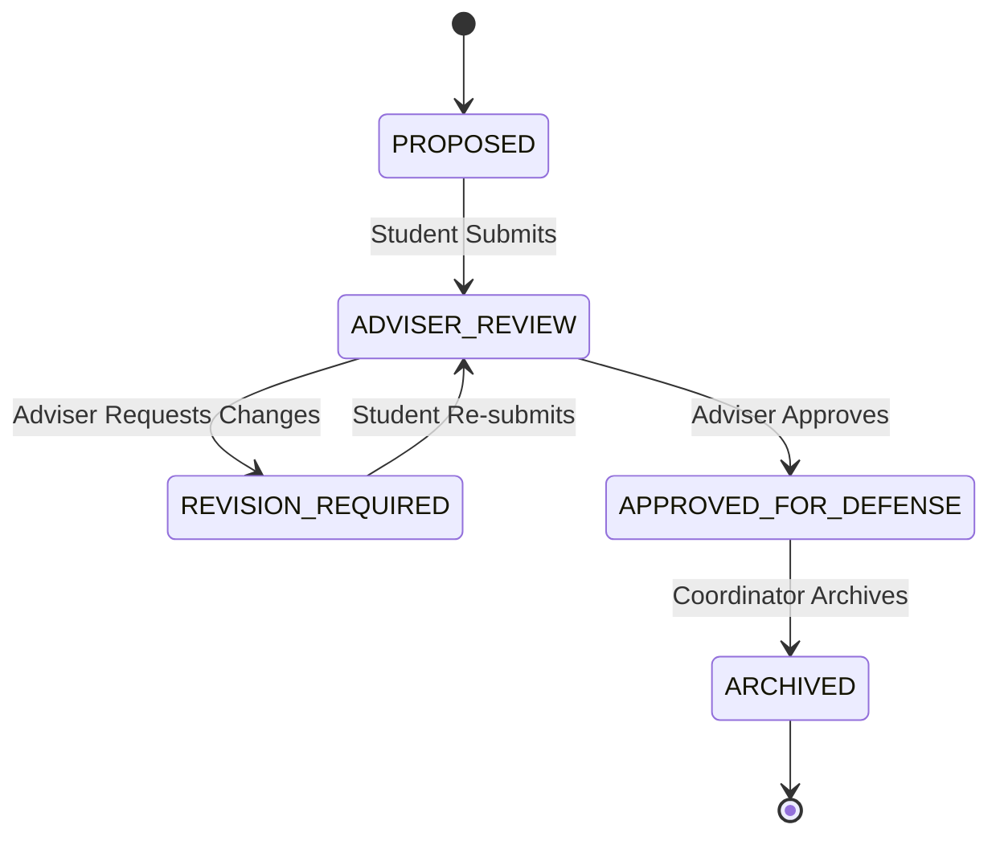

# Capstone Workflow Diagrams

## Project Status State Machine

The project lifecycle follows a strict state machine to ensure academic integrity.

### States (Enums)
1.  **PROPOSED**: Initial state. Student creates a project proposal.
2.  **ADVISER_REVIEW**: Student submits the proposal/document for adviser review.
3.  **REVISION_REQUIRED**: Adviser returns the document with feedback.
4.  **APPROVED_FOR_DEFENSE**: Adviser approves the document for panel defense.
5.  **ARCHIVED**: Project is completed and archived by the Coordinator.

### Transitions

### Rules
*   **Uploads**: Allowed only in `PROPOSED` and `REVISION_REQUIRED`.
*   **Adviser Review**: Only Advisers can transition from `ADVISER_REVIEW`.
*   **Archival**: Only Coordinators can transition to `ARCHIVED`.
