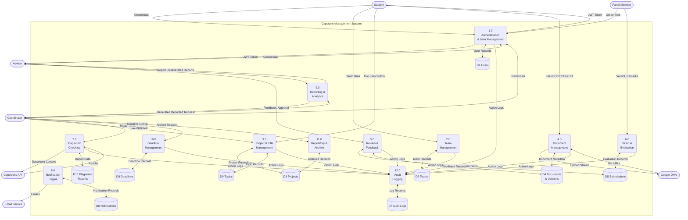

# Data Flow Diagrams — Capstone Management System

## Mermaid.js DFD Reference

> **Tip:** Paste each `mermaid` block into [https://mermaid.live](https://mermaid.live) to render.
>
> Mermaid.js does not have a native DFD node type, so we use the following conventions:
> - **External Entities** → Stadium-shaped `([Entity])`
> - **Processes** → Rounded `(Process)`
> - **Data Stores** → Cylinder `[(Data Store)]`
> - **Data Flows** → Labeled arrows `-->|label|`

---

## Table of Contents

1. [Context Diagram (Level 0)](#1-context-diagram-level-0)
2. [Level 1 — System Overview DFD](#2-level-1--system-overview-dfd)
3. [Functional Requirements DFDs — Student (FR-S01 to FR-S74)](#3-functional-requirements--student)
4. [Functional Requirements DFDs — Adviser (FR-A01 to FR-A47)](#4-functional-requirements--adviser)
5. [Functional Requirements DFDs — Panel (FR-P01 to FR-P53)](#5-functional-requirements--panel)
6. [Functional Requirements DFDs — Coordinator (FR-C01 to FR-C70)](#6-functional-requirements--coordinator)
7. [Combined Functional Requirements DFDs (FR01 to FR24)](#7-combined-functional-requirements-fr01-to-fr24)
8. [Non-Functional Requirements DFDs (NFR01 to NFR12)](#8-non-functional-requirements-nfr01-to-nfr12)

---

## 1. Context Diagram (Level 0)

Shows the entire Capstone Management System as a single process with all external entities.


---

## 2. Level 1 — System Overview DFD

Decomposes the system into major processes.



---

## 3. Functional Requirements — Student

### 3.1 Authentication (FR-S01 to FR-S07)


### 3.2 Team Formation (FR-S08 to FR-S13)


### 3.3 Project Setup — Topic & Title (FR-S14 to FR-S20)


### 3.4 Capstone 1 — Proposal & Chapter 1-3 (FR-S21 to FR-S35)


### 3.5 Capstone 2 — System Development (FR-S36 to FR-S47)


### 3.6 Capstone 3 — Final Defense (FR-S48 to FR-S54)


### 3.7 Submission Concurrency Control (FR-S55 to FR-S58)


### 3.8 Supporting Actions & Reports (FR-S62 to FR-S74)


---

## 4. Functional Requirements — Adviser

### 4.1 Authentication (FR-A01 to FR-A04)


### 4.2 Project Review — Capstone 1 (FR-A05 to FR-A24)


### 4.3 Project Review — Capstone 2 (FR-A25 to FR-A29)


### 4.4 Project Review — Capstone 3 (FR-A30 to FR-A34)


### 4.5 Collaboration & Feedback (FR-A35 to FR-A37)


### 4.6 Reports (FR-A38 to FR-A41)


### 4.7 Supporting Actions (FR-A42 to FR-A47)


---

## 5. Functional Requirements — Panel

### 5.1 Authentication (FR-P01 to FR-P04)


### 5.2 Topic Management (FR-P05 to FR-P11)


### 5.3 Capstone 1 Defense Evaluation (FR-P12 to FR-P24)


### 5.4 Capstone 2 System Defense (FR-P25 to FR-P32)

```mermaid
flowchart LR
    PANEL([Panel Member])

    PANEL -->|FR-P25: Review| P4_1(4.1 Review System\nDocumentation)
    DS_DOCS[(D4 Documents)] -->|Design, Dev Docs,\nTest Results| P4_1
    P4_1 -->|System Docs| PANEL

    PANEL -->|FR-P26: Attend| P4_2(4.2 Attend System\nDefense Demo)

    PANEL -->|FR-P27: Evaluate| P4_3(4.3 Evaluate System\nFunctionality)

    PANEL -->|FR-P28: Verdict| P4_4(4.4 System\nDefense Verdict)

    P4_4 -->|FR-P29: Passed| P4_5(4.5 Record Passed\n+ Remarks)
    P4_5 -->|Store Verdict| DS_SUBMISSIONS[(D5 Submissions)]

    P4_4 -->|FR-P30: Conditional| P4_6(4.6 Record Conditional\n+ Improvements)
    P4_6 -->|Store + Notify\nStudent| DS_SUBMISSIONS
    P4_6 -->|Re-present Option| DS_NOTIF[(D6 Notifications)]

    P4_4 -->|FR-P31: Failed| P4_7(4.7 Record\nFailed + Remarks)
    P4_7 -->|Store Verdict| DS_SUBMISSIONS

    P4_5 & P4_6 & P4_7 -->|FR-P32: Update Status| DS_PROJECTS[(D3 Projects)]
    P4_5 & P4_6 & P4_7 -->|Log Verdict| DS_AUDIT[(D7 Audit Logs)]
```

### 5.5 Capstone 3 Final Defense (FR-P33 to FR-P40)

```mermaid
flowchart LR
    PANEL([Panel Member])

    PANEL -->|FR-P33: Review| P5_1(5.1 Review\nFinal Paper)
    DS_DOCS[(D4 Documents)] -->|Academic +\nJournal Format| P5_1
    P5_1 -->|Final Papers| PANEL

    PANEL -->|FR-P34: Attend| P5_2(5.2 Attend\nFinal Defense)

    PANEL -->|FR-P35: Evaluate| P5_3(5.3 Evaluate\nCompleteness)

    PANEL -->|FR-P36: Verdict| P5_4(5.4 Final\nDefense Verdict)

    P5_4 -->|FR-P37: Passed| P5_5(5.5 Record Passed\nProject Approved)
    P5_5 -->|Store Verdict +\nRemarks| DS_SUBMISSIONS[(D5 Submissions)]
    P5_5 -->|Status:\nFINAL_APPROVED| DS_PROJECTS[(D3 Projects)]

    P5_4 -->|FR-P38: Conditional| P5_6(5.6 Require\nFinal Revisions)
    P5_6 -->|Store Revision\nRequirements| DS_SUBMISSIONS
    P5_6 -->|Notify Student\nRe-present| DS_NOTIF[(D6 Notifications)]

    P5_4 -->|FR-P39: Failed| P5_7(5.7 Record\nFailed)
    P5_7 -->|Store Comprehensive\nRemarks| DS_SUBMISSIONS

    P5_5 & P5_6 & P5_7 -->|FR-P40: Log| DS_AUDIT[(D7 Audit Logs)]
```

### 5.6 Credentials Review (FR-P41 to FR-P44)

```mermaid
flowchart LR
    PANEL([Panel Member])

    PANEL -->|FR-P41: View| P6_1(6.1 View Uploaded\nCredentials)
    DS_DOCS[(D4 Documents)] -->|Credential Files| P6_1
    P6_1 -->|Credential List| PANEL

    PANEL -->|FR-P42: Review| P6_2(6.2 Review\nEach Document)
    P6_2 -->|Download| GDRIVE([Google Drive])

    P6_2 -->|FR-P42a| P6_3(6.3 Ethics Review\nCertificate)
    P6_2 -->|FR-P42b| P6_4(6.4 Hardbound\nReceipt)
    P6_2 -->|FR-P42c| P6_5(6.5 Panel\nApproval Form)
    P6_2 -->|FR-P42d| P6_6(6.6 Other\nClearance Docs)

    P6_3 & P6_4 & P6_5 & P6_6 -->|FR-P43: Verify| P6_7(6.7 Verify\nAuthenticity)

    P6_7 -->|FR-P44: Mark| P6_8(6.8 Mark\nCredentials Verified)
    P6_8 -->|Update Verification\nStatus| DS_DOCS
    P6_8 -->|Log Verification| DS_AUDIT[(D7 Audit Logs)]
```

### 5.7 Reports (FR-P45 to FR-P48)

```mermaid
flowchart LR
    PANEL([Panel Member])

    PANEL -->|FR-P45: Generate| P7_1(7.1 Evaluation\nSummary Report)
    DS_SUBMISSIONS[(D5 Submissions)] -->|All Verdicts,\nRemarks per Project| P7_1
    P7_1 -->|Pass/Conditional/Fail\nCounts per Stage| PANEL

    PANEL -->|FR-P46: Generate| P7_2(7.2 Defense\nSchedule Report)
    DS_PROJECTS[(D3 Projects)] -->|Upcoming Defenses\nCap 1/2/3| P7_2
    P7_2 -->|Dates, Teams,\nSubmission Status| PANEL

    PANEL -->|FR-P47: Generate| P7_3(7.3 Workload\nOverview Report)
    DS_SUBMISSIONS -->|Assignments,\nPending, Completed| P7_3
    P7_3 -->|Workload Stats| PANEL

    PANEL -->|FR-P48: Generate| P7_4(7.4 Topic\nUtilization Report)
    DS_TOPICS[(D9 Topics)] -->|Created vs Claimed,\nKeyword Distribution| P7_4
    P7_4 -->|Utilization Report| PANEL

    P7_1 & P7_2 & P7_3 & P7_4 -->|Export| P7_5(7.5 Export\nCSV / PDF)
    P7_5 -->|Report File| PANEL
```

### 5.8 Supporting Actions (FR-P49 to FR-P53)

```mermaid
flowchart LR
    PANEL([Panel Member])

    PANEL -->|FR-P49: Request| P8_1(8.1 View\nEvaluation History)
    DS_SUBMISSIONS[(D5 Submissions)] -->|Past Verdicts,\nRemarks| P8_1
    P8_1 -->|History Data| PANEL

    PANEL -->|FR-P50: Request| P8_2(8.2 View Project\nAudit Trail)
    DS_AUDIT[(D7 Audit Logs)] -->|Action Log| P8_2
    P8_2 -->|Audit Trail| PANEL

    PANEL -->|FR-P51: View| P8_3(8.3 View\nNotifications)
    DS_NOTIF[(D6 Notifications)] -->|Assignment,\nDefense Alerts| P8_3
    P8_3 -->|Notification List| PANEL

    PANEL -->|FR-P52: Action| P8_4(8.4 Mark\nNotifications Read)
    P8_4 -->|Update Status| DS_NOTIF

    PANEL -->|FR-P53a: Reset| P8_5(8.5 Reset\nPassword)
    P8_5 -->|Reset Flow| DS_USERS[(D1 Users)]

    PANEL -->|FR-P53b: Update| P8_6(8.6 Update\nProfile)
    P8_6 -->|Update Record| DS_USERS
```

---

## 6. Functional Requirements — Coordinator / Instructor

### 6.1 Authentication (FR-C01 to FR-C04)

```mermaid
flowchart LR
    COORD([Coordinator])

    COORD -->|FR-C01: Email,\nPassword| P1_1(1.1 Coordinator\nLogin)
    P1_1 -->|Validate| DS_USERS[(D1 Users)]
    P1_1 -->|FR-C02: JWT Token| COORD
    P1_1 -->|Log Login| DS_AUDIT[(D7 Audit Logs)]

    P1_1 -->|FR-C03: Load| P1_2(1.2 Coordinator\nDashboard)
    DS_PROJECTS[(D3 Projects)] -->|Total Projects,\nActive Teams| P1_2
    DS_NOTIF[(D6 Notifications)] -->|Pending Actions| P1_2
    P1_2 -->|FR-C04: System-wide\nOverview| COORD
```

### 6.2 User Management (FR-C05 to FR-C10)

```mermaid
flowchart LR
    COORD([Coordinator])

    COORD -->|FR-C05: Search/Filter\nby Role, Team, Status| P2_1(2.1 List & Search\nAll Users)
    DS_USERS[(D1 Users)] -->|User Records| P2_1
    P2_1 -->|User List| COORD

    COORD -->|FR-C06: Select User| P2_2(2.2 View User\nDetails)
    DS_USERS -->|Role, Team,\nAssigned Projects| P2_2
    P2_2 -->|User Details| COORD

    COORD -->|FR-C07: New Role| P2_3(2.3 Change\nUser Role)
    P2_3 -->|Update Role\nStudent/Adviser/Panel/\nCoordinator| DS_USERS
    P2_3 -->|Log Role Change| DS_AUDIT[(D7 Audit Logs)]

    COORD -->|FR-C08: Name, Email,\nRole| P2_4(2.4 Create\nNew User)
    P2_4 -->|Store New User| DS_USERS
    P2_4 -->|Send Invite Email| EMAIL([Email Service])

    COORD -->|FR-C09: Enable/\nDisable| P2_5(2.5 Manage\nAccount Status)
    P2_5 -->|Update Status| DS_USERS
    P2_5 -->|Log Action| DS_AUDIT

    COORD -->|FR-C10: Student ID,\nTeam ID| P2_6(2.6 Adopt\nOrphan Student)
    P2_6 -->|Assign Student\nto Team| DS_TEAMS[(D2 Teams)]
    P2_6 -->|Log Assignment| DS_AUDIT
```

### 6.3 Project Administration (FR-C11 to FR-C23)

```mermaid
flowchart LR
    COORD([Coordinator])

    COORD -->|FR-C11: View All\nNo Restrictions| P3_1(3.1 View ALL\nProjects)
    DS_PROJECTS[(D3 Projects)] -->|All Statuses,\nAll Academic Years| P3_1
    P3_1 -->|Complete Project\nList| COORD

    COORD -->|FR-C12: Select| P3_2(3.2 Select\nProject)
    DS_DOCS[(D4 Documents)] -->|All Submissions| P3_2
    P3_2 -->|Project Details| COORD

    COORD -->|FR-C13: Download| P3_3(3.3 Download\nAll Submissions)
    P3_3 -->|Fetch Files| GDRIVE([Google Drive])
    P3_3 -->|Files| COORD

    COORD -->|FR-C14: Adviser ID| P3_4(3.4 Assign\nAdviser)
    P3_4 -->|Link Adviser\nto Project| DS_PROJECTS
    P3_4 -->|Notify Adviser| DS_NOTIF[(D6 Notifications)]
    P3_4 -->|Log Assignment| DS_AUDIT[(D7 Audit Logs)]

    COORD -->|FR-C15: Panel IDs| P3_5(3.5 Assign\nPanelists)
    P3_5 -->|Link Panelists\nto Project| DS_PROJECTS
    P3_5 -->|Notify Panelists| DS_NOTIF

    COORD -->|FR-C16: Review\nTitle Change| P3_6(3.6 Review Title\nChange Request)
    DS_PROJECTS -->|Student Request\n+ Rationale| P3_6
    P3_6 -->|FR-C17: Approve| P3_7(3.7 Approve\nTitle Change)
    P3_7 -->|Update Title\nAdd to History\nLock Title| DS_PROJECTS
    P3_6 -->|FR-C18: Reject| P3_8(3.8 Reject with\nComment)
    P3_8 -->|Return with\nReview Comment| DS_PROJECTS
    P3_8 -->|Notify Student| DS_NOTIF

    COORD -->|FR-C19: Archive\nCommand| P3_9(3.9 Archive\nProject)
    P3_9 -->|Status: ARCHIVED| DS_PROJECTS

    COORD -->|FR-C20: Reset\nCommand| P3_10(3.10 Reset\nProject)
    P3_10 -->|Archive Current\nVersion| DS_PROJECTS
    P3_10 -->|Create Fresh Copy\nat TOPIC_SELECTION| DS_PROJECTS

    COORD -->|FR-C21: Title,\nTeam, Description| P3_11(3.11 Create Project\non Behalf of Team)
    P3_11 -->|Store New Project| DS_PROJECTS

    COORD -->|FR-C22: Override| P3_12(3.12 Override\nStatus Restrictions)
    P3_12 -->|Force Status\nChange| DS_PROJECTS
    P3_12 -->|Log Override| DS_AUDIT

    COORD -->|FR-C23: Multiple\nAdvisers| P3_13(3.13 Assign\nMultiple Advisers)
    P3_13 -->|Link All Advisers| DS_PROJECTS
    P3_13 -->|Notify All| DS_NOTIF
```

### 6.4 Deadline Management (FR-C24 to FR-C31)

```mermaid
flowchart LR
    COORD([Coordinator])

    COORD -->|FR-C24: Phase,\nSub-stage| P4_1(4.1 Create\nDeadline)
    P4_1 -->|Store Deadline\nRecord| DS_DEADLINES[(D8 Deadlines)]

    COORD -->|FR-C25: Due Date,\nTarget Status| P4_2(4.2 Set Due\nDate & Target)
    P4_2 -->|Update Deadline\nConfig| DS_DEADLINES

    COORD -->|FR-C26: Year| P4_3(4.3 Associate\nAcademic Year)
    P4_3 -->|Link to Year| DS_DEADLINES

    COORD -->|FR-C27: Publish| P4_4(4.4 Publish\nDeadline)
    P4_4 -->|Set Published| DS_DEADLINES
    P4_4 -->|Notify Students\n& Advisers| DS_NOTIF[(D6 Notifications)]
    P4_4 -->|Send Email\nAlerts| EMAIL([Email Service])

    COORD -->|FR-C28: Modified\nDate| P4_5(4.5 Modify\nDeadline)
    P4_5 -->|Update Deadline| DS_DEADLINES
    P4_5 -->|Re-notify All\nAffected Users| DS_NOTIF

    COORD -->|FR-C29: Monitor\nRequest| P4_6(4.6 Monitor\nSubmissions vs Deadlines)
    DS_DEADLINES -->|Due Dates| P4_6
    DS_DOCS[(D4 Documents)] -->|Submission Dates\nper Chapter per Phase| P4_6
    P4_6 -->|Compliance\nOverview| COORD

    COORD -->|FR-C30: View\nRequest| P4_7(4.7 View Late\nSubmission Flags)
    DS_DOCS -->|Student, Phase,\nDate, Justification| P4_7
    P4_7 -->|Late Submissions\nList| COORD

    COORD -->|FR-C31: Dashboard\nRequest| P4_8(4.8 Deadline\nDashboard)
    DS_DEADLINES -->|All Deadlines| P4_8
    P4_8 -->|Deadline Overview| COORD
```

### 6.5 System & Document Administration (FR-C32 to FR-C46)

```mermaid
flowchart LR
    COORD([Coordinator])

    COORD -->|FR-C32: Config Data| P5_1(5.1 Configure\nSystem Settings)

    P5_1 -->|FR-C33: Max Size| P5_2(5.2 Set Max\nTeam Size)
    P5_2 -->|Store Config:\n1 Leader + 3 Max| DS_SETTINGS[(D11 Settings)]

    P5_1 -->|FR-C34: Policies| P5_3(5.3 Configure\nDeadline Policies)
    P5_3 -->|Store Late\nSubmission Rules| DS_SETTINGS

    P5_1 -->|FR-C35: Prefs| P5_4(5.4 Configure\nNotification Preferences)
    P5_4 -->|Store Email/In-app\nTrigger Config| DS_SETTINGS

    COORD -->|FR-C36: Legacy Files| P5_5(5.5 Upload\nLegacy Projects)
    P5_5 -->|Stream Files| GDRIVE([Google Drive])
    P5_5 -->|Store Historical\nRecords| DS_PROJECTS[(D3 Projects)]

    COORD -->|FR-C37: Sync\nCommand| P5_6(5.6 Sync\nGoogle Drive)
    P5_6 -->|Organize Parent\nFolder Structure| GDRIVE
    P5_6 -->|Import as\nRead-only Records| DS_PROJECTS

    COORD -->|FR-C38-46: Various\nDoc Admin| P5_7(5.7 Document\nAdministration)
    P5_7 -->|Manage Doc\nAccess & Structure| DS_DOCS[(D4 Documents)]
    P5_7 -->|Log Admin Actions| DS_AUDIT[(D7 Audit Logs)]
```

### 6.6 Plagiarism Management (FR-C38 to FR-C43)

```mermaid
flowchart LR
    COORD([Coordinator])

    COORD -->|FR-C38: Monitor\nQueue| P6_1(6.1 Monitor All\nFINAL_COMPILATION)
    DS_PROJECTS[(D3 Projects)] -->|Projects at\nFinal Compilation| P6_1
    P6_1 -->|Plagiarism Queue| COORD

    COORD -->|FR-C39: Trigger\nScan per Project| P6_2(6.2 Trigger\nPlagiarism Check)
    DS_DOCS[(D4 Documents)] -->|Document Content| P6_2
    P6_2 -->|Send for Analysis| COPYLEAKS([Copyleaks API])

    P6_2 -->|FR-C40: Status:\nPLAGIARISM_CHECK| P6_3(6.3 Update\nCheck Status)
    P6_3 -->|Pending → In Progress\n→ Completed| DS_PROJECTS

    COPYLEAKS -->|Similarity Score\n0-100, Passages,\nSource Links| P6_4(6.4 Receive\nResults)
    P6_4 -->|Store Report| DS_PLAG[(D10 Plagiarism\nReports)]

    COORD -->|FR-C41: View\nReport| P6_5(6.5 View\nPlagiarism Report)
    DS_PLAG -->|Full Report Data| P6_5
    P6_5 -->|Score, Passages,\nSources| COORD

    P6_5 -->|FR-C42: Score\nAcceptable?| P6_6{6.6 Evaluate\nScore}
    P6_6 -->|Yes| P6_7(6.7 Advance to\nFINAL_DEFENSE)
    P6_7 -->|Update Status| DS_PROJECTS

    P6_6 -->|FR-C43: No -\nHigh Similarity| P6_8(6.8 Flag\nProject)
    P6_8 -->|Hold from\nDefense Queue| DS_PROJECTS
    P6_8 -->|Notify Adviser\n& Student| DS_NOTIF[(D6 Notifications)]
    P6_8 -->|Send Alert Email| EMAIL([Email Service])
```

### 6.7 Reports & Analytics (FR-C47 to FR-C53)

#### Category 1: Project Progress & Status Analytics

```mermaid
flowchart LR
    COORD([Coordinator])

    COORD -->|FR-C47: Generate| P7_1(7.1 Status\nDistribution Report)
    DS_PROJECTS[(D3 Projects)] -->|Count per Status:\nTopic Selection,\nProposal Defense, etc.| P7_1
    P7_1 -->|Status Distribution\nChart| COORD

    COORD -->|FR-C48: Generate| P7_2(7.2 Bottleneck\nDetection)
    DS_PROJECTS -->|Projects Stuck\n> 14 days in\nSame Status| P7_2
    DS_AUDIT[(D7 Audit Logs)] -->|Last Transition\nDates| P7_2
    P7_2 -->|Bottleneck Flags| COORD

    COORD -->|FR-C49: Generate| P7_3(7.3 Submission\nCompliance Report)
    DS_DOCS[(D4 Documents)] -->|Submission Dates| P7_3
    DS_DEADLINES[(D8 Deadlines)] -->|Coordinator\nDeadlines| P7_3
    P7_3 -->|Missed Deadlines\nper Group per Phase| COORD

    P7_1 & P7_2 & P7_3 -->|Export| P7_EXP(Export\nCSV / PDF)
    P7_EXP -->|Report File| COORD
```

#### Category 2: Research & Topic Insights — Gap Analysis

```mermaid
flowchart LR
    COORD([Coordinator])

    COORD -->|FR-C50: Generate| P8_1(8.1 Keyword\nFrequency Report)
    DS_PROJECTS[(D3 Projects)] -->|Project Titles,\nDescriptions,\nKeywords| P8_1
    P8_1 -->|Most-used Tech\n& Topics: AI,\nBlockchain, IoT\nHeatmap| COORD

    COORD -->|FR-C51: Generate| P8_2(8.2 Departmental\nTrends)
    DS_PROJECTS -->|Project Volume\nby Program| P8_2
    P8_2 -->|BSIT vs BSEMC\nComparison| COORD

    COORD -->|FR-C52: Generate| P8_3(8.3 Research Gap\nSuggestions)
    DS_PROJECTS -->|Legacy Keywords\nvs Current Year| P8_3
    P8_3 -->|Underexplored\nResearch Areas| COORD

    P8_1 & P8_2 & P8_3 -->|Export| P8_EXP(Export\nCSV / PDF)
    P8_EXP -->|Report File| COORD
```

#### Category 3: Adviser & Panelist Workload

```mermaid
flowchart LR
    COORD([Coordinator])

    COORD -->|FR-C53a: Generate| P9_1(9.1 Adviser Load\nReport)
    DS_PROJECTS[(D3 Projects)] -->|Projects per\nAdviser| P9_1
    P9_1 -->|Workload\nDistribution| COORD

    COORD -->|FR-C53b: Generate| P9_2(9.2 Review\nTurnaround Report)
    DS_DOCS[(D4 Documents)] -->|Submission &\nFeedback Dates| P9_2
    P9_2 -->|Avg Time per\nAdviser per Chapter| COORD

    COORD -->|FR-C53c: Generate| P9_3(9.3 Defense\nSchedule Overview)
    DS_PROJECTS -->|Upcoming Defenses\nAssigned Panelists| P9_3
    P9_3 -->|Schedule:\nProposal, System,\nFinal Defenses| COORD

    P9_1 & P9_2 & P9_3 -->|Export| P9_EXP(Export\nCSV / PDF)
    P9_EXP -->|Report File| COORD
```

#### Category 4: Plagiarism & Integrity

```mermaid
flowchart LR
    COORD([Coordinator])

    COORD -->|FR-C53d: Generate| P10_1(10.1 Average\nSimilarity Report)
    DS_PLAG[(D10 Plagiarism\nReports)] -->|All Scores\nCurrent Submissions| P10_1
    P10_1 -->|Average %\nOverview| COORD

    COORD -->|FR-C53e: Generate| P10_2(10.2 High-Risk\nAlerts)
    DS_PLAG -->|Scores > 20%| P10_2
    P10_2 -->|Flagged Groups\nwith Scores| COORD

    COORD -->|FR-C53f: Generate| P10_3(10.3 Version\nHistory Audit)
    DS_DOCS[(D4 Documents)] -->|Revision Count\nper Group| P10_3
    DS_PLAG -->|Flagged then\nCleared Records| P10_3
    P10_3 -->|Revision Audit| COORD

    P10_1 & P10_2 & P10_3 -->|Export| P10_EXP(Export\nCSV / PDF)
    P10_EXP -->|Report File| COORD
```

#### Category 5: System Usage & Audit Logs

```mermaid
flowchart LR
    COORD([Coordinator])

    COORD -->|FR-C53g: Generate| P11_1(11.1 Active User\nSessions Report)
    DS_AUDIT[(D7 Audit Logs)] -->|Login Events,\nSession Data| P11_1
    DS_USERS[(D1 Users)] -->|Role Breakdown| P11_1
    P11_1 -->|Daily/Weekly Active\nStudents vs Faculty| COORD

    COORD -->|FR-C53h: Generate| P11_2(11.2 Storage\nUtilization Report)
    DS_DOCS[(D4 Documents)] -->|File Sizes,\nUpload Counts| P11_2
    GDRIVE([Google Drive]) -->|Usage vs\n15GB Limit| P11_2
    P11_2 -->|Storage per Year\nper Project| COORD

    COORD -->|FR-C53i: Generate| P11_3(11.3 Audit Trail\nSummary)
    DS_AUDIT -->|Title Changes,\nStatus Overrides,\nRole Changes,\nLogin Events| P11_3
    P11_3 -->|Critical Actions\nLog Summary| COORD

    P11_1 & P11_2 & P11_3 -->|Export| P11_EXP(Export\nCSV / PDF)
    P11_EXP -->|Report File| COORD
```

### 6.8 Repository & Gap Analysis (FR-C54 to FR-C62)

```mermaid
flowchart LR
    COORD([Coordinator])

    COORD -->|FR-C54: Access| P12_1(12.1 Access Archived\nRepository)
    DS_PROJECTS[(D3 Projects)] -->|Full Data\nNo Restrictions| P12_1
    P12_1 -->|Archived\nProject List| COORD

    COORD -->|FR-C55: Search by\nTitle, Keyword,\nYear, Phase| P12_2(12.2 Search\nArchive)
    DS_PROJECTS -->|Filtered\nResults| P12_2
    P12_2 -->|Search Results| COORD

    COORD -->|FR-C56: Select| P12_3(12.3 View Full\nProject Details)
    DS_PROJECTS -->|Chapters, Docs,\nVerdicts, Trail| P12_3
    DS_DOCS[(D4 Documents)] -->|All Documents| P12_3
    DS_AUDIT[(D7 Audit Logs)] -->|Action History| P12_3
    P12_3 -->|Complete Project\nRecord| COORD

    COORD -->|FR-C57: Run| P12_4(12.4 Run Gap\nAnalysis)
    DS_PROJECTS -->|All Project\nKeywords & Titles| P12_4

    P12_4 -->|FR-C58: View| P12_5(12.5 View Keyword\nFrequencies)
    P12_5 -->|Keyword Clusters\nAcross All Projects| COORD

    P12_5 -->|FR-C59: Generate| P12_6(12.6 Generate Gap\nSuggestions)
    P12_6 -->|Underexplored\nResearch Areas| COORD

    P12_6 -->|FR-C60: Export| P12_7(12.7 Export Gap\nAnalysis Report)
    P12_7 -->|CSV / PDF| COORD

    COORD -->|FR-C61: Manage| P12_8(12.8 Manage\nArchive Access)
    P12_8 -->|Access Controls| DS_PROJECTS

    COORD -->|FR-C62: Import\nLegacy| P12_9(12.9 Import\nLegacy Data)
    P12_9 -->|Store Historical\nRecords| DS_PROJECTS
    P12_9 -->|Upload Files| GDRIVE([Google Drive])
```

### 6.9 Supporting Actions (FR-C63 to FR-C70)

```mermaid
flowchart LR
    COORD([Coordinator])

    COORD -->|FR-C63: View| P13_1(13.1 View All\nSystem Notifications)
    DS_NOTIF[(D6 Notifications)] -->|All Users,\nAll Projects| P13_1
    P13_1 -->|Complete\nNotification Feed| COORD

    COORD -->|FR-C64: View| P13_2(13.2 View System\nAudit Logs)
    DS_AUDIT[(D7 Audit Logs)] -->|Status Transitions,\nRole Changes, Logins,\nUploads, Approvals,\nSimilarity Scans| P13_2
    P13_2 -->|Complete\nAudit Log| COORD

    COORD -->|FR-C65: Action| P13_3(13.3 Mark\nNotifications Read)
    P13_3 -->|Update Status| DS_NOTIF

    COORD -->|FR-C66: Reset\nRequest| P13_4(13.4 Reset\nPassword)
    P13_4 -->|Send Reset Email| EMAIL([Email Service])
    P13_4 -->|Update Password| DS_USERS[(D1 Users)]

    COORD -->|FR-C67: Profile\nData| P13_5(13.5 Update\nProfile)
    P13_5 -->|Update Record| DS_USERS

    COORD -->|FR-C68: Force\nReset| P13_6(13.6 Force User\nPassword Reset)
    P13_6 -->|Invalidate\nCurrent Password| DS_USERS
    P13_6 -->|Send Reset Email\nto Target User| EMAIL

    COORD -->|FR-C69: Config| P13_7(13.7 System\nConfiguration)
    P13_7 -->|Update System\nSettings| DS_SETTINGS[(D11 Settings)]

    COORD -->|FR-C70: Dashboard| P13_8(13.8 Full\nDashboard)
    DS_PROJECTS[(D3 Projects)] -->|System Stats| P13_8
    DS_USERS -->|User Counts| P13_8
    DS_NOTIF -->|Alert Counts| P13_8
    P13_8 -->|System-wide\nOverview| COORD
```

---

## 7. Combined Functional Requirements (FR01 to FR24)

These are the consolidated SRS-level requirements from the Capstone paper.

### 7.1 Authentication & User Management (FR01, FR02, FR24)

```mermaid
flowchart TD
    ALL_USERS([All Users])
    COORD([Coordinator])

    ALL_USERS -->|FR01: Valid\nCredentials| P1(1.0 Login\nAuthentication)
    P1 -->|Validate| DS_USERS[(D1 Users)]
    P1 -->|JWT Token| ALL_USERS
    P1 -->|Log Login| DS_AUDIT[(D7 Audit Logs)]

    COORD -->|FR02: Create/Manage\nUser Accounts| P2(2.0 User\nManagement)
    P2 -->|CRUD Operations\nStudents, Advisers,\nPanel Members| DS_USERS
    P2 -->|Send Invites| EMAIL([Email Service])

    ALL_USERS -->|FR24: Dashboard\nRequest| P3(3.0 Role-Based\nDashboard)
    DS_PROJECTS[(D3 Projects)] -->|Progress, Pending\nSubmissions, Status| P3
    DS_NOTIF[(D6 Notifications)] -->|Alerts| P3
    P3 -->|Personalized\nDashboard| ALL_USERS
```

### 7.2 Group & Team Management (FR03, FR04)

```mermaid
flowchart LR
    STUDENT([Student])
    COORD([Coordinator])

    STUDENT -->|FR03: Create Group\nLink Members| P1(1.0 Group\nRegistration)
    P1 -->|Store Team Record\nLink Members to\nOne Project| DS_TEAMS[(D2 Teams)]
    P1 -->|Create Project\nRecord| DS_PROJECTS[(D3 Projects)]

    COORD -->|FR04: Assign\nAdviser & Panel| P2(2.0 Assign\nFaculty)
    P2 -->|Link Adviser\nto Group| DS_PROJECTS
    P2 -->|Link Panelists\nto Group| DS_PROJECTS
    P2 -->|Notify Assigned\nFaculty| DS_NOTIF[(D6 Notifications)]
```

### 7.3 Document Upload & Vault (FR05 to FR08)

```mermaid
flowchart LR
    LEADER([Student / Leader])

    LEADER -->|FR05: Upload per\nChapter 1-5| P1(1.0 Upload\nChapter Document)
    P1 -->|FR06: Validate Format\nDOCX/PDF/TXT| P2(2.0 Format\nValidation)
    P2 -->|Valid: Stream\nto Storage| GDRIVE([Google Drive])
    P2 -->|Invalid: Reject\nwith Error| LEADER

    GDRIVE -->|File ID, URL| P3(3.0 Store in\nDocument Vault)
    P3 -->|FR07: Version Record\nUpload Date, Chapter,\nFile Type, Uploader,\nStatus| DS_DOCS[(D4 Documents\nVault)]

    LEADER -->|FR08: View\nHistory Request| P4(4.0 Display\nSubmission History)
    DS_DOCS -->|All Versions\nper Chapter| P4
    P4 -->|Version History\nwith Metadata| LEADER
```

### 7.4 Review & Feedback (FR09, FR10, FR13, FR14, FR15)

```mermaid
flowchart LR
    ADVISER([Adviser])
    PANEL([Panel Member])
    COORD([Coordinator])

    ADVISER -->|FR09: View/Download\nBased on Role| P1(1.0 Access\nSubmitted Docs)
    PANEL -->|FR09: View/Download\nBased on Role| P1
    P1 -->|Fetch File| GDRIVE([Google Drive])
    DS_DOCS[(D4 Documents)] -->|Document List\nper Permission| P1
    P1 -->|Downloaded Docs| ADVISER
    P1 -->|Downloaded Docs| PANEL

    ADVISER -->|FR10: Comments,\nRevision Notes per\nVersion| P2(2.0 Provide\nFeedback)
    PANEL -->|FR10: Comments,\nRevision Notes| P2
    P2 -->|Store Feedback| DS_DOCS

    ADVISER -->|FR13: Set For Revision\nor Approved| P3(3.0 Change\nSubmission Status)
    P3 -->|Update Status| DS_DOCS
    P3 -->|Notify Student| DS_NOTIF[(D6 Notifications)]
    P3 -->|Log Change| DS_AUDIT[(D7 Audit Logs)]

    P3 -->|FR14: System Check| P4(4.0 Enforce Chapter\nProgression)
    DS_DOCS -->|Previous Chapter\nApproval Status| P4
    P4 -->|Block: Previous\nNot Approved| ADVISER
    P4 -->|Allow: Previous\nApproved| P3

    COORD -->|FR15: Override\nRestriction| P5(5.0 Unlock\nSubmission)
    P5 -->|Bypass Chapter\nLock| DS_DOCS
    P5 -->|Log Override| DS_AUDIT
```

### 7.5 Deadline Management (FR11, FR12)

```mermaid
flowchart LR
    COORD([Coordinator])
    STUDENT([Student])

    COORD -->|FR11: Set Deadline\nper Chapter, per Stage\nDraft/Pre-final/Final| P1(1.0 Set\nDeadlines)
    P1 -->|Store Deadline\nRecord| DS_DEADLINES[(D8 Deadlines)]

    DS_DEADLINES -->|Check Approaching\nor Missed| P2(2.0 Deadline\nMonitor Job)
    DS_DOCS[(D4 Documents)] -->|Submission Dates| P2

    P2 -->|FR12: Approaching\nDeadline Alert| P3(3.0 Generate\nNotification)
    P3 -->|In-app Alert| DS_NOTIF[(D6 Notifications)]
    P3 -->|Email Alert| EMAIL([Email Service])
    P3 -->|Notification\nDisplayed| STUDENT

    P2 -->|FR12: Missed\nDeadline Alert| P3
```

### 7.6 Plagiarism Checking (FR16 to FR20)

```mermaid
flowchart LR
    SYSTEM([System\nAutomatic])
    ALL([Adviser, Panel,\nCoordinator,\nStudent])

    DS_DOCS[(D4 Documents)] -->|FR16: Pre-final/Final\nSubmission Detected| P1(1.0 Auto-Trigger\nSimilarity Check)

    P1 -->|FR17: Send Document\nContent| COPYLEAKS([Copyleaks API])

    P1 -->|FR18: Also Compare\nAgainst| DS_VAULT[(D4 Internal\nIT Repository)]

    COPYLEAKS -->|FR19: Results| P2(2.0 Process\nSimilarity Results)
    P2 -->|Display: Score %,\nMatched Passages,\nSource Links| ALL

    P2 -->|FR20: Store Report\nper Document Version| DS_PLAG[(D10 Plagiarism\nReports)]

    ALL -->|View Report\nRequest| P3(3.0 Retrieve\nReport)
    DS_PLAG -->|Stored Report| P3
    P3 -->|Report Data\nStudents: View-only| ALL
```

### 7.7 Archive & Repository (FR21, FR22)

```mermaid
flowchart LR
    SYSTEM([System])
    FACULTY([Adviser,\nCoordinator, Panel])

    SYSTEM -->|FR21: Final\nApproved| P1(1.0 Archive\nManuscript)
    DS_DOCS[(D4 Documents)] -->|Final Document| P1
    P1 -->|Set Read-only\nTag Official\nFinal Copy| DS_ARCHIVE[(D4 Archived\nDocuments)]

    FACULTY -->|FR22: Search by\nTitle, Author, Year,\nAdviser, Program| P2(2.0 Search\nArchived Projects)
    DS_ARCHIVE -->|Matching Records| P2
    P2 -->|Search Results| FACULTY
```

### 7.8 Audit Logging (FR23)

```mermaid
flowchart LR
    SYSTEM([System\nAll Modules])

    SYSTEM -->|FR23: User Action\nUpload, Approval,\nComment, Scan| P1(1.0 Log\nUser Activity)
    P1 -->|Action Record:\nUser ID, Action Type,\nTimestamp, Metadata| DS_AUDIT[(D7 Audit Logs)]

    COORD([Coordinator]) -->|View Audit Request| P2(2.0 Query\nAudit Logs)
    DS_AUDIT -->|Filtered Logs| P2
    P2 -->|Audit Report| COORD
```

---

## 8. Non-Functional Requirements (NFR01 to NFR12)

Non-functional requirements describe system qualities. The DFDs below show how data flows through cross-cutting architectural concerns.

### 8.1 NFR01 — Web Compatibility (Browsers)

```mermaid
flowchart LR
    USER([User\nChrome/Firefox/Edge])

    USER -->|HTTP/HTTPS\nRequest| P1(NFR01: Web Server\nBrowser Compatibility\nLayer)
    P1 -->|Responsive HTML/CSS/JS\nStandards-compliant| USER

    P1 -->|Route Request| P2(Application\nServer)
    P2 -->|JSON/HTML\nResponse| P1

    P1 -.->|Cross-browser\nCSS, Polyfills,\nMedia Queries| DS_STATIC[(Static Assets\nCSS, JS, Images)]
```

### 8.2 NFR02 — Responsive Interface (Desktop & Mobile)

```mermaid
flowchart LR
    DESKTOP([Desktop User])
    MOBILE([Mobile User])

    DESKTOP -->|Full Viewport\nRequest| P1(NFR02: Responsive\nUI Renderer)
    MOBILE -->|Small Viewport\nRequest| P1

    P1 -->|Read Viewport\nBreakpoints| DS_CSS[(Tailwind CSS\nResponsive Config)]
    DS_CSS -->|Breakpoint Rules\nmd: lg: xl:| P1

    P1 -->|Adaptive Layout\nDesktop View| DESKTOP
    P1 -->|Adaptive Layout\nMobile View| MOBILE
```

### 8.3 NFR03 — Role-Based Access Control (RBAC)

```mermaid
flowchart LR
    USER([Authenticated User])

    USER -->|Request + JWT\nToken| P1(NFR03: RBAC\nMiddleware)
    P1 -->|Extract User ID\n& Role from Token| DS_USERS[(D1 Users)]
    DS_USERS -->|User Role:\nStudent/Adviser/\nPanel/Coordinator| P1

    P1 -->|Role Has\nPermission?| P2{NFR03:\nAuthorization\nCheck}

    P2 -->|Yes: Proceed| P3(Protected\nRoute/Action)
    P3 -->|Access Data| DS_DATA[(Protected\nData Stores)]
    P3 -->|Response| USER

    P2 -->|No: Deny| P4(403 Forbidden\nResponse)
    P4 -->|Access Denied\nMessage| USER
    P4 -->|Log Unauthorized\nAttempt| DS_AUDIT[(D7 Audit Logs)]
```

### 8.4 NFR04 — Document Confidentiality

```mermaid
flowchart LR
    USER([Authorized User])
    UNAUTH([Unauthorized User])

    USER -->|Request Document\nwith Valid Token| P1(NFR04: Document\nAccess Controller)
    P1 -->|Verify User Belongs\nto Project/Team| DS_USERS[(D1 Users)]
    P1 -->|Check Role\nPermissions| DS_PROJECTS[(D3 Projects)]

    P1 -->|Authorized:\nGenerate Signed URL| GDRIVE([Google Drive])
    GDRIVE -->|Temporary\nSigned URL| P1
    P1 -->|Document\nAccess Granted| USER

    UNAUTH -->|Request without\nValid Token/Role| P1
    P1 -->|Deny: 403\nConfidential Document| UNAUTH
    P1 -->|Log Attempt| DS_AUDIT[(D7 Audit Logs)]
```

### 8.5 NFR05 — Secure Storage

```mermaid
flowchart LR
    APP([Application\nServer])

    APP -->|NFR05: Store\nDocument Metadata| P1(Secure Storage\nController)
    P1 -->|Encrypted Connection\nTLS/SSL| DS_DB[(MongoDB\nDatabase)]
    P1 -->|Access Restricted\nby Auth Middleware| DS_DB

    APP -->|Store File\nContent| GDRIVE([Google Drive\nAPI])
    GDRIVE -->|Encrypted at Rest\nGoogle Managed Keys| GDRIVE_STORE[(Google Drive\nStorage)]

    P1 -->|Metadata: File ID,\nTenant, Chapter,\nStatus, Permissions| DS_DB
    GDRIVE -->|File Content:\nBinary Data| GDRIVE_STORE

    DS_DB -.->|Access Only via\nAuthenticated API\nCalls| APP
```

### 8.6 NFR06 — Audit Logging

```mermaid
flowchart LR
    UPLOAD([Upload Action])
    COMMENT([Comment Action])
    APPROVAL([Approval Action])
    SCAN([Similarity Scan])

    UPLOAD -->|User ID, File ID,\nTimestamp, Chapter| P1(NFR06: Audit\nLog Writer)
    COMMENT -->|User ID, Project ID,\nComment Text, Version| P1
    APPROVAL -->|User ID, Project ID,\nOld Status, New Status| P1
    SCAN -->|Project ID,\nScore, Source Count| P1

    P1 -->|Immutable Log Entry\nTimestamp, Actor,\nAction, Metadata| DS_AUDIT[(D7 Audit Logs)]

    COORD([Coordinator]) -->|Query Logs| P2(NFR06: Audit\nLog Reader)
    DS_AUDIT -->|Filtered\nLog Entries| P2
    P2 -->|Audit Report| COORD
```

### 8.7 NFR07 — Performance Efficiency

```mermaid
flowchart LR
    USER([User])

    USER -->|Page Request| P1(NFR07: Performance\nOptimization Layer)

    P1 -->|Check Cache| DS_CACHE[(Redis Cache)]
    DS_CACHE -->|Cache Hit:\nReturn Cached Data\n< 2s Response| P1

    P1 -->|Cache Miss:\nQuery Database| DS_DB[(MongoDB)]
    DS_DB -->|Query Result| P1
    P1 -->|Store in Cache\nTTL: Configurable| DS_CACHE

    P1 -->|Optimized Response\nTarget: < 2s| USER

    P1 -.->|Index Optimization,\nQuery Optimization,\nPagination, Lazy Load| DS_DB
```

### 8.8 NFR08 — Concurrent User Handling

```mermaid
flowchart LR
    USER1([User 1])
    USER2([User 2])
    USERN([User N\n37+ UAT])

    USER1 -->|Concurrent Request| P1(NFR08: Load\nBalancer / Server)
    USER2 -->|Concurrent Request| P1
    USERN -->|Concurrent Request| P1

    P1 -->|Connection Pool\nManagement| DS_DB[(MongoDB\nConnection Pool)]
    P1 -->|Rate Limiting\nper User/IP| P2(Rate Limiter\nMiddleware)

    P1 -->|Atomic Operations\nfor Submissions| DS_SUBMISSIONS[(D5 Submissions)]

    P1 -->|Queue Heavy Tasks\nEmail, PDF, Scan| DS_QUEUE[(Job Queue)]
    DS_QUEUE -->|Process\nAsynchronously| P3(Background\nWorker)

    P1 -->|Stable Response\nNo Failure under\nPeak Load| USER1
    P1 -->|Stable Response| USER2
    P1 -->|Stable Response| USERN
```

### 8.9 NFR09 — Error Handling & Messages

```mermaid
flowchart LR
    USER([User])

    USER -->|Invalid Input\nor Failed Action| P1(NFR09: Error\nHandling Middleware)

    P1 -->|Validation Error:\nInvalid Input| P2(Input Validator\nJoi Schema)
    P2 -->|Clear Error Message:\nField, Reason, Expected| USER

    P1 -->|Upload Error:\nFile Too Large /\nWrong Format| P3(File Validator)
    P3 -->|Error: Max 25MB\nOnly DOCX/PDF/TXT| USER

    P1 -->|Server Error:\nUnexpected Failure| P4(Centralized Error\nHandler)
    P4 -->|Generic Message:\nSomething went wrong\nPlease try again| USER
    P4 -->|Log Detailed Error\nStack Trace, Context| DS_LOGS[(Error Logs)]

    P1 -->|Auth Error:\nInvalid Token| P5(Auth Error\nHandler)
    P5 -->|Error: Session Expired\nPlease Login Again| USER
```

### 8.10 NFR10 — Maintainability (MVC Architecture)

```mermaid
flowchart TD
    REQUEST([HTTP Request])

    REQUEST -->|NFR10: Route| P1(Routes\nroutes/api.js)
    P1 -->|Delegate to| P2(Controllers\nBusiness Logic\nOrchestration)
    P2 -->|Validate with| P3(Middleware\nAuth, Validation,\nError Handling)
    P2 -->|Query/Mutate via| P4(Models\nMongoose Schemas\nData Access)
    P4 -->|CRUD Operations| DS_DB[(MongoDB)]

    P2 -->|Call External| P5(Services\nEmail, Google Drive,\nCopyleaks API)

    P2 -->|Render View or\nJSON Response| RESPONSE([HTTP Response])

    P1 -.->|Separation of\nConcerns: Route\n→ Controller\n→ Model\n→ Service| P1
```

### 8.11 NFR11 — Plagiarism Service Availability

```mermaid
flowchart LR
    SYSTEM([System])

    SYSTEM -->|Trigger Scan| P1(NFR11: Plagiarism\nService Gateway)

    P1 -->|Check API\nRate Limits| DS_RATE[(Rate Limit\nTracker)]

    DS_RATE -->|Under Limit| P2(Send to\nCopyleaks API)
    P2 -->|API Request| COPYLEAKS([Copyleaks API])
    COPYLEAKS -->|Response:\nResults| P2
    P2 -->|Store Results| DS_PLAG[(D10 Plagiarism\nReports)]
    P2 -->|Update Status:\nCompleted| DS_PROJECTS[(D3 Projects)]

    DS_RATE -->|Rate Limit\nExceeded| P3(Queue for\nRetry)
    P3 -->|Store in\nRetry Queue| DS_QUEUE[(Job Queue)]
    P3 -->|Update Status:\nPending| DS_PROJECTS

    COPYLEAKS -->|API Down /\nTimeout| P4(Handle\nService Outage)
    P4 -->|Log Error,\nRetry Later| DS_QUEUE
    P4 -->|Notify Coordinator:\nService Unavailable| DS_NOTIF[(D6 Notifications)]
```

### 8.12 NFR12 — Future Scalability

```mermaid
flowchart TD
    CURRENT([Current System\nCapstone Projects])

    CURRENT -->|NFR12: Modular\nArchitecture| P1(Scalable\nDesign Layer)

    P1 -->|Modular Route\nRegistration| P2(Route Module\nLoader)
    P2 -->|Current: /api/v1/projects\nFuture: /api/v1/thesis\n/api/v1/research| DS_ROUTES[(Route\nRegistry)]

    P1 -->|Configurable\nDocument Types| P3(Document Type\nConfig)
    P3 -->|Current: Capstone Chapters\nFuture: Thesis, OJT,\nResearch Papers| DS_CONFIG[(System\nConfig)]

    P1 -->|Extensible\nRole Model| P4(Role\nExtension)
    P4 -->|Current: Student, Adviser,\nPanel, Coordinator\nFuture: Dean, Registrar,\nExternal Reviewer| DS_USERS[(D1 Users)]

    P1 -->|Plugin-based\nIntegration Points| P5(Integration\nPlugins)
    P5 -->|Current: Copyleaks,\nGoogle Drive\nFuture: Turnitin,\nOneDrive, LMS| DS_INTEGRATIONS[(Integration\nRegistry)]
```

---

## Summary — Data Store Reference

| Store ID | Name | Description |
|----------|------|-------------|
| D1 | Users | User accounts, credentials, roles, profiles |
| D2 | Teams | Team records, members, invitations, lock status |
| D3 | Projects | Project records, titles, statuses, phase history |
| D4 | Documents & Versions | Document metadata, version history, feedback, credential files |
| D5 | Submissions | Submission locks, atomic status, evaluation verdicts |
| D6 | Notifications | In-app and email notification records |
| D7 | Audit Logs | Immutable action logs with timestamps |
| D8 | Deadlines | Coordinator-set deadlines per phase/chapter |
| D9 | Topics | Pre-approved topics by panel members |
| D10 | Plagiarism Reports | Similarity scores, matched passages, source links |
| D11 | Settings | System configuration, tenant settings |

---

## External Entity Reference

| Entity | Description |
|--------|-------------|
| Student | Registers, forms teams, uploads documents, submits for review |
| Adviser | Reviews submissions, provides feedback, approves chapters |
| Panel Member | Evaluates defenses, records verdicts, manages topics |
| Coordinator | Manages users, deadlines, plagiarism checks, system config |
| Google Drive API | External file storage service |
| Copyleaks API | External plagiarism/similarity checking service |
| Email Service | Nodemailer email delivery |
| Web Browser | Client application interface |

---

> **Source:** Capstone Management System — Functional and Non-Functional Requirements  
> **Institution:** BukSU — Project Workspace  
> **Coverage:** FR-S01–FR-S74, FR-A01–FR-A47, FR-P01–FR-P53, FR-C01–FR-C70, FR01–FR24, NFR01–NFR12
