# Use Case Diagram — Project Workspace: Capstone Management System

## System Information

| Field | Value |
|---|---|
| **System Name** | Project Workspace — Capstone Management System |
| **System Type** | Web Application (MERN Stack SaaS) |
| **Purpose** | A comprehensive capstone project management platform that enables students, advisers, panelists, and instructors (administrators) to collaborate through the full capstone lifecycle — from team formation and title proposal through document submission, plagiarism checking, evaluation, and defense. |

---

## Actors

| # | Actor | Type | Description |
|---|---|---|---|
| 1 | **Student** | Primary | Registers, forms teams, proposes titles, drafts/uploads documents, tracks progress, and views feedback. The Team Leader (a student sub-role) can invite members and lock the team roster. |
| 2 | **Adviser** | Primary | Reviews assigned student projects, accesses submitted documents and plagiarism reports, provides comments, requests revisions, and approves or rejects submissions. |
| 3 | **Panelist** | Primary | Evaluates assigned capstone projects during defense, inputs scores, provides recommendations, and renders a final verdict (Pass / Pass with Revisions / Failed). |
| 4 | **Instructor (Admin)** | Primary | Manages user accounts and roles, monitors all projects, configures plagiarism thresholds, generates system reports, and archives completed projects. |
| 5 | **Google Drive** | External System | Provides cloud file storage for document uploads and Google Docs collaborative drafting integration. |
| 6 | **Email Service** | External System | Delivers OTP verification emails, team invitations, and system notifications (deadline alerts, approvals, revisions). |

---

## Use Case Catalog

### A. Authentication & Profile (Shared / Generalized)

| UC ID | Use Case | Actors | Req ID |
|---|---|---|---|
| UC-01 | Log In | Student, Adviser, Panelist, Instructor | FR-01, FR-AD-01, FR-PA-01, FR-INS-01 |
| UC-02 | Log Out | Student, Adviser, Panelist, Instructor | FR-AD-01, FR-PA-01, FR-INS-01 |
| UC-03 | Register Account | Student | FR-01 |
| UC-04 | Verify Email (OTP) | Student | FR-01 |
| UC-05 | Reset Password | Student | FR-02 |
| UC-06 | Update Profile | Student | FR-02 |

### B. Team Management (Student)

| UC ID | Use Case | Actors | Req ID |
|---|---|---|---|
| UC-07 | Create Team | Student | FR-03 |
| UC-08 | Join Team via Invitation | Student | FR-03 |
| UC-09 | Invite Team Members | Student (Team Leader) | FR-04 |
| UC-10 | Lock Team Roster | Student (Team Leader) | FR-04 |

### C. Project Initiation (Student)

| UC ID | Use Case | Actors | Req ID |
|---|---|---|---|
| UC-11 | Create Project Title | Student | FR-05 |
| UC-12 | Check Title Similarity | System (auto) | FR-05 |
| UC-13 | Revise Title | Student | FR-06 |
| UC-14 | Submit Title Change Request | Student | FR-06 |

### D. Capstone 1 — Proposal (Student)

| UC ID | Use Case | Actors | Req ID |
|---|---|---|---|
| UC-15 | Generate Auto-Template (Google Docs) | Student | FR-07 |
| UC-16 | Upload Chapter Documents | Student | FR-08 |
| UC-17 | Submit Late Justification | Student | FR-09 |

### E. Capstone 2 — Development (Student)

| UC ID | Use Case | Actors | Req ID |
|---|---|---|---|
| UC-18 | Track Development Status | Student | FR-10 |
| UC-19 | Upload Source Code / Design Docs | Student | FR-11 |

### F. Revision & Defense (Student)

| UC ID | Use Case | Actors | Req ID |
|---|---|---|---|
| UC-20 | View Feedback | Student | FR-12 |
| UC-21 | Submit Revised Work | Student | FR-12 |
| UC-22 | Track Project Phase Status | Student | FR-13 |

### G. Concurrency & Integrity (System)

| UC ID | Use Case | Actors | Req ID |
|---|---|---|---|
| UC-23 | Enforce Concurrency Control | System (auto) | FR-14 |

### H. Plagiarism (Shared)

| UC ID | Use Case | Actors | Req ID |
|---|---|---|---|
| UC-24 | View Plagiarism Report | Student, Adviser, Panelist | FR-15, FR-AD-04, FR-PA-03 |

### I. Monitoring & Logs (Student)

| UC ID | Use Case | Actors | Req ID |
|---|---|---|---|
| UC-25 | View Progress Report | Student | FR-16 |
| UC-26 | View Submission History | Student | FR-16 |
| UC-27 | View Audit Trail | Student | FR-16 |

### J. Notifications (Shared)

| UC ID | Use Case | Actors | Req ID |
|---|---|---|---|
| UC-28 | Receive Notifications | Student, Adviser | FR-17, FR-AD-07 |

### K. Adviser Functions

| UC ID | Use Case | Actors | Req ID |
|---|---|---|---|
| UC-29 | View Assigned Projects | Adviser | FR-AD-02 |
| UC-30 | Access Submitted Documents | Adviser | FR-AD-03 |
| UC-31 | Provide Comments / Request Revisions | Adviser | FR-AD-05 |
| UC-32 | Approve or Reject Submission | Adviser | FR-AD-06 |

### L. Panelist Functions

| UC ID | Use Case | Actors | Req ID |
|---|---|---|---|
| UC-33 | View Assigned Capstone Projects | Panelist | FR-PA-02 |
| UC-34 | Input Evaluation Scores | Panelist | FR-PA-04 |
| UC-35 | Provide Comments & Recommendations | Panelist | FR-PA-05 |
| UC-36 | Mark Final Project Result | Panelist | FR-PA-06 |
| UC-37 | Submit Final Evaluation | Panelist | FR-PA-07 |

### M. Instructor / Admin Functions

| UC ID | Use Case | Actors | Req ID |
|---|---|---|---|
| UC-38 | Manage User Accounts (CRUD) | Instructor | FR-INS-02 |
| UC-39 | Assign Roles & Permissions | Instructor | FR-INS-03 |
| UC-40 | Monitor All Projects | Instructor | FR-INS-04 |
| UC-41 | Set Plagiarism Threshold | Instructor | FR-INS-05 |
| UC-42 | Generate System Reports | Instructor | FR-INS-06 |
| UC-43 | Archive Completed Projects | Instructor | FR-INS-07 |
| UC-44 | Unlock Panelist Evaluation | Instructor | FR-PA-07 |

---

## Relationships Summary

| Relationship | From | To | Type |
|---|---|---|---|
| UC-03 Register Account | — | UC-04 Verify Email (OTP) | «include» |
| UC-04 Verify Email (OTP) | — | Email Service | association |
| UC-11 Create Project Title | — | UC-12 Check Title Similarity | «include» |
| UC-12 Check Title Similarity | — | UC-13 Revise Title | «extend» (if high similarity) |
| UC-12 Check Title Similarity | — | UC-14 Submit Title Change Request | «extend» (if high similarity) |
| UC-16 Upload Chapter Documents | — | Google Drive | association |
| UC-16 Upload Chapter Documents | — | UC-17 Submit Late Justification | «extend» (if past deadline) |
| UC-16 Upload Chapter Documents | — | UC-23 Enforce Concurrency Control | «include» |
| UC-19 Upload Source Code / Design Docs | — | Google Drive | association |
| UC-19 Upload Source Code / Design Docs | — | UC-23 Enforce Concurrency Control | «include» |
| UC-15 Generate Auto-Template | — | Google Drive | association |
| UC-09 Invite Team Members | — | Email Service | association |
| UC-28 Receive Notifications | — | Email Service | association |
| UC-34 Input Evaluation Scores | — | UC-37 Submit Final Evaluation | «include» |
| UC-37 Submit Final Evaluation | — | UC-44 Unlock Panelist Evaluation | «extend» (admin override) |
| Student ◁— Team Leader | — | — | generalization |

---

## PlantUML Diagram

```plantuml
@startuml UseCase_CapstoneManagementSystem

' ============================================================
'  Theme & Styling
' ============================================================
skinparam actorStyle awesome
skinparam packageStyle rectangle
skinparam usecase {
    BackgroundColor<<auth>> #E8F5E9
    BorderColor<<auth>> #388E3C
    BackgroundColor<<team>> #E3F2FD
    BorderColor<<team>> #1565C0
    BackgroundColor<<project>> #FFF3E0
    BorderColor<<project>> #EF6C00
    BackgroundColor<<capstone1>> #F3E5F5
    BorderColor<<capstone1>> #7B1FA2
    BackgroundColor<<capstone2>> #FCE4EC
    BorderColor<<capstone2>> #C62828
    BackgroundColor<<defense>> #E0F7FA
    BorderColor<<defense>> #00838F
    BackgroundColor<<plagiarism>> #FBE9E7
    BorderColor<<plagiarism>> #BF360C
    BackgroundColor<<monitoring>> #F1F8E9
    BorderColor<<monitoring>> #558B2F
    BackgroundColor<<adviser>> #E8EAF6
    BorderColor<<adviser>> #283593
    BackgroundColor<<panel>> #EFEBE9
    BorderColor<<panel>> #4E342E
    BackgroundColor<<admin>> #FFEBEE
    BorderColor<<admin>> #B71C1C
    BackgroundColor<<notification>> #FFFDE7
    BorderColor<<notification>> #F9A825
}

' ============================================================
'  Actors
' ============================================================
actor "Student" as Student
actor "Team Leader" as TeamLeader
actor "Adviser" as Adviser
actor "Panelist" as Panelist
actor "Instructor\n(Admin)" as Instructor
actor "Google Drive" as GDrive <<External>>
actor "Email Service" as Email <<External>>

' ── Generalization: Team Leader IS-A Student ──
TeamLeader --|> Student

' ============================================================
'  System Boundary
' ============================================================
rectangle "Project Workspace — Capstone Management System" {

    ' ─── Authentication & Profile ───
    package "Authentication & Profile" {
        usecase "Log In" as UC01 <<auth>>
        usecase "Log Out" as UC02 <<auth>>
        usecase "Register Account" as UC03 <<auth>>
        usecase "Verify Email\n(OTP)" as UC04 <<auth>>
        usecase "Reset Password" as UC05 <<auth>>
        usecase "Update Profile" as UC06 <<auth>>
    }

    ' ─── Team Management ───
    package "Team Management" {
        usecase "Create Team" as UC07 <<team>>
        usecase "Join Team\nvia Invitation" as UC08 <<team>>
        usecase "Invite Team\nMembers" as UC09 <<team>>
        usecase "Lock Team\nRoster" as UC10 <<team>>
    }

    ' ─── Project Initiation ───
    package "Project Initiation" {
        usecase "Create Project\nTitle" as UC11 <<project>>
        usecase "Check Title\nSimilarity" as UC12 <<project>>
        usecase "Revise Title" as UC13 <<project>>
        usecase "Submit Title\nChange Request" as UC14 <<project>>
    }

    ' ─── Capstone 1 (Proposal) ───
    package "Capstone 1 — Proposal" {
        usecase "Generate Auto-\nTemplate (Google Docs)" as UC15 <<capstone1>>
        usecase "Upload Chapter\nDocuments" as UC16 <<capstone1>>
        usecase "Submit Late\nJustification" as UC17 <<capstone1>>
    }

    ' ─── Capstone 2 (Development) ───
    package "Capstone 2 — Development" {
        usecase "Track Development\nStatus" as UC18 <<capstone2>>
        usecase "Upload Source Code\n/ Design Docs" as UC19 <<capstone2>>
    }

    ' ─── Revision & Defense ───
    package "Revision & Defense" {
        usecase "View Feedback" as UC20 <<defense>>
        usecase "Submit Revised\nWork" as UC21 <<defense>>
        usecase "Track Project\nPhase Status" as UC22 <<defense>>
    }

    ' ─── Concurrency & Integrity ───
    package "Concurrency & Integrity" {
        usecase "Enforce Concurrency\nControl" as UC23
    }

    ' ─── Plagiarism ───
    package "Plagiarism" {
        usecase "View Plagiarism\nReport" as UC24 <<plagiarism>>
    }

    ' ─── Monitoring & Logs ───
    package "Monitoring & Logs" {
        usecase "View Progress\nReport" as UC25 <<monitoring>>
        usecase "View Submission\nHistory" as UC26 <<monitoring>>
        usecase "View Audit\nTrail" as UC27 <<monitoring>>
    }

    ' ─── Notifications ───
    package "Notifications" {
        usecase "Receive\nNotifications" as UC28 <<notification>>
    }

    ' ─── Adviser Functions ───
    package "Adviser Functions" {
        usecase "View Assigned\nProjects" as UC29 <<adviser>>
        usecase "Access Submitted\nDocuments" as UC30 <<adviser>>
        usecase "Provide Comments /\nRequest Revisions" as UC31 <<adviser>>
        usecase "Approve or Reject\nSubmission" as UC32 <<adviser>>
    }

    ' ─── Panelist Functions ───
    package "Panelist Functions" {
        usecase "View Assigned\nCapstone Projects" as UC33 <<panel>>
        usecase "Input Evaluation\nScores" as UC34 <<panel>>
        usecase "Provide Comments &\nRecommendations" as UC35 <<panel>>
        usecase "Mark Final\nProject Result" as UC36 <<panel>>
        usecase "Submit Final\nEvaluation" as UC37 <<panel>>
    }

    ' ─── Instructor / Admin Functions ───
    package "Instructor / Admin Functions" {
        usecase "Manage User\nAccounts (CRUD)" as UC38 <<admin>>
        usecase "Assign Roles &\nPermissions" as UC39 <<admin>>
        usecase "Monitor All\nProjects" as UC40 <<admin>>
        usecase "Set Plagiarism\nThreshold" as UC41 <<admin>>
        usecase "Generate System\nReports" as UC42 <<admin>>
        usecase "Archive Completed\nProjects" as UC43 <<admin>>
        usecase "Unlock Panelist\nEvaluation" as UC44 <<admin>>
    }
}

' ============================================================
'  Actor –– Use Case Associations
' ============================================================

' ── Student ──
Student --> UC01
Student --> UC02
Student --> UC03
Student --> UC05
Student --> UC06
Student --> UC07
Student --> UC08
Student --> UC11
Student --> UC15
Student --> UC16
Student --> UC18
Student --> UC19
Student --> UC20
Student --> UC21
Student --> UC22
Student --> UC24
Student --> UC25
Student --> UC26
Student --> UC27
Student --> UC28

' ── Team Leader (inherits Student + extra) ──
TeamLeader --> UC09
TeamLeader --> UC10

' ── Adviser ──
Adviser --> UC01
Adviser --> UC02
Adviser --> UC24
Adviser --> UC28
Adviser --> UC29
Adviser --> UC30
Adviser --> UC31
Adviser --> UC32

' ── Panelist ──
Panelist --> UC01
Panelist --> UC02
Panelist --> UC24
Panelist --> UC33
Panelist --> UC34
Panelist --> UC35
Panelist --> UC36
Panelist --> UC37

' ── Instructor (Admin) ──
Instructor --> UC01
Instructor --> UC02
Instructor --> UC38
Instructor --> UC39
Instructor --> UC40
Instructor --> UC41
Instructor --> UC42
Instructor --> UC43
Instructor --> UC44

' ============================================================
'  «include» Relationships
' ============================================================
UC03 ..> UC04 : <<include>>
UC11 ..> UC12 : <<include>>
UC16 ..> UC23 : <<include>>
UC19 ..> UC23 : <<include>>
UC34 ..> UC37 : <<include>>

' ============================================================
'  «extend» Relationships
' ============================================================
UC13 ..> UC12 : <<extend>>\n[high similarity]
UC14 ..> UC12 : <<extend>>\n[high similarity]
UC17 ..> UC16 : <<extend>>\n[past deadline]
UC44 ..> UC37 : <<extend>>\n[admin override]

' ============================================================
'  External System Associations
' ============================================================
UC04 --> Email : sends OTP
UC09 --> Email : sends invitation
UC28 --> Email : delivers alerts
UC15 --> GDrive : creates doc
UC16 --> GDrive : uploads file
UC19 --> GDrive : uploads file
UC30 --> GDrive : retrieves file

@enduml
```

---

## Mermaid.js Diagram

> **Note:** Mermaid does not natively support UML Use Case Diagram notation. The diagram below uses a flowchart representation with subgraphs to logically group use cases, dashed lines for «include»/«extend», and actor nodes on the outside.

```mermaid
flowchart LR

    %% ============================================================
    %%  ACTORS (outside system boundary)
    %% ============================================================
    Student(("👤 Student"))
    TeamLeader(("👑 Team Leader"))
    Adviser(("👨‍🏫 Adviser"))
    Panelist(("👨‍⚖️ Panelist"))
    Instructor(("🛡️ Instructor\n(Admin)"))
    GDrive[/"☁️ Google Drive"\]
    EmailSvc[/"📧 Email Service"\]

    %% ── Generalization ──
    TeamLeader -.->|"IS-A"| Student

    %% ============================================================
    %%  SYSTEM BOUNDARY
    %% ============================================================
    subgraph SYS ["🏛️ Project Workspace — Capstone Management System"]
        direction TB

        %% ─── Authentication & Profile ───
        subgraph AUTH ["Authentication & Profile"]
            UC01["UC-01: Log In"]
            UC02["UC-02: Log Out"]
            UC03["UC-03: Register Account"]
            UC04["UC-04: Verify Email (OTP)"]
            UC05["UC-05: Reset Password"]
            UC06["UC-06: Update Profile"]
        end

        %% ─── Team Management ───
        subgraph TEAM ["Team Management"]
            UC07["UC-07: Create Team"]
            UC08["UC-08: Join Team via Invitation"]
            UC09["UC-09: Invite Team Members"]
            UC10["UC-10: Lock Team Roster"]
        end

        %% ─── Project Initiation ───
        subgraph PROJ ["Project Initiation"]
            UC11["UC-11: Create Project Title"]
            UC12["UC-12: Check Title Similarity"]
            UC13["UC-13: Revise Title"]
            UC14["UC-14: Submit Title Change Request"]
        end

        %% ─── Capstone 1 (Proposal) ───
        subgraph CAP1 ["Capstone 1 — Proposal"]
            UC15["UC-15: Generate Auto-Template"]
            UC16["UC-16: Upload Chapter Documents"]
            UC17["UC-17: Submit Late Justification"]
        end

        %% ─── Capstone 2 (Development) ───
        subgraph CAP2 ["Capstone 2 — Development"]
            UC18["UC-18: Track Development Status"]
            UC19["UC-19: Upload Source Code / Design Docs"]
        end

        %% ─── Revision & Defense ───
        subgraph DEF ["Revision & Defense"]
            UC20["UC-20: View Feedback"]
            UC21["UC-21: Submit Revised Work"]
            UC22["UC-22: Track Project Phase Status"]
        end

        %% ─── Concurrency ───
        subgraph CONC ["Concurrency & Integrity"]
            UC23["UC-23: Enforce Concurrency Control"]
        end

        %% ─── Plagiarism ───
        subgraph PLAG ["Plagiarism"]
            UC24["UC-24: View Plagiarism Report"]
        end

        %% ─── Monitoring & Logs ───
        subgraph MON ["Monitoring & Logs"]
            UC25["UC-25: View Progress Report"]
            UC26["UC-26: View Submission History"]
            UC27["UC-27: View Audit Trail"]
        end

        %% ─── Notifications ───
        subgraph NOTIF ["Notifications"]
            UC28["UC-28: Receive Notifications"]
        end

        %% ─── Adviser Functions ───
        subgraph ADV ["Adviser Functions"]
            UC29["UC-29: View Assigned Projects"]
            UC30["UC-30: Access Submitted Documents"]
            UC31["UC-31: Provide Comments / Request Revisions"]
            UC32["UC-32: Approve or Reject Submission"]
        end

        %% ─── Panelist Functions ───
        subgraph PAN ["Panelist Functions"]
            UC33["UC-33: View Assigned Capstone Projects"]
            UC34["UC-34: Input Evaluation Scores"]
            UC35["UC-35: Provide Comments & Recommendations"]
            UC36["UC-36: Mark Final Project Result"]
            UC37["UC-37: Submit Final Evaluation"]
        end

        %% ─── Admin Functions ───
        subgraph ADMIN ["Instructor / Admin Functions"]
            UC38["UC-38: Manage User Accounts (CRUD)"]
            UC39["UC-39: Assign Roles & Permissions"]
            UC40["UC-40: Monitor All Projects"]
            UC41["UC-41: Set Plagiarism Threshold"]
            UC42["UC-42: Generate System Reports"]
            UC43["UC-43: Archive Completed Projects"]
            UC44["UC-44: Unlock Panelist Evaluation"]
        end
    end

    %% ============================================================
    %%  STUDENT ASSOCIATIONS
    %% ============================================================
    Student --> UC01
    Student --> UC02
    Student --> UC03
    Student --> UC05
    Student --> UC06
    Student --> UC07
    Student --> UC08
    Student --> UC11
    Student --> UC15
    Student --> UC16
    Student --> UC18
    Student --> UC19
    Student --> UC20
    Student --> UC21
    Student --> UC22
    Student --> UC24
    Student --> UC25
    Student --> UC26
    Student --> UC27
    Student --> UC28

    %% ── Team Leader extras ──
    TeamLeader --> UC09
    TeamLeader --> UC10

    %% ============================================================
    %%  ADVISER ASSOCIATIONS
    %% ============================================================
    Adviser --> UC01
    Adviser --> UC02
    Adviser --> UC24
    Adviser --> UC28
    Adviser --> UC29
    Adviser --> UC30
    Adviser --> UC31
    Adviser --> UC32

    %% ============================================================
    %%  PANELIST ASSOCIATIONS
    %% ============================================================
    Panelist --> UC01
    Panelist --> UC02
    Panelist --> UC24
    Panelist --> UC33
    Panelist --> UC34
    Panelist --> UC35
    Panelist --> UC36
    Panelist --> UC37

    %% ============================================================
    %%  INSTRUCTOR (ADMIN) ASSOCIATIONS
    %% ============================================================
    Instructor --> UC01
    Instructor --> UC02
    Instructor --> UC38
    Instructor --> UC39
    Instructor --> UC40
    Instructor --> UC41
    Instructor --> UC42
    Instructor --> UC43
    Instructor --> UC44

    %% ============================================================
    %%  «include» RELATIONSHIPS
    %% ============================================================
    UC03 -. "«include»" .-> UC04
    UC11 -. "«include»" .-> UC12
    UC16 -. "«include»" .-> UC23
    UC19 -. "«include»" .-> UC23
    UC34 -. "«include»" .-> UC37

    %% ============================================================
    %%  «extend» RELATIONSHIPS
    %% ============================================================
    UC13 -. "«extend»\n[high similarity]" .-> UC12
    UC14 -. "«extend»\n[high similarity]" .-> UC12
    UC17 -. "«extend»\n[past deadline]" .-> UC16
    UC44 -. "«extend»\n[admin override]" .-> UC37

    %% ============================================================
    %%  EXTERNAL SYSTEM ASSOCIATIONS
    %% ============================================================
    UC04 --> EmailSvc
    UC09 --> EmailSvc
    UC28 --> EmailSvc
    UC15 --> GDrive
    UC16 --> GDrive
    UC19 --> GDrive
    UC30 --> GDrive
```

---

## Relationship Legend

| Symbol | Meaning |
|---|---|
| ——→ (solid line) | **Association** — Actor interacts with use case |
| - - -▷ **«include»** | **Mandatory inclusion** — Base use case always triggers the included use case |
| - - -▷ **«extend»** | **Optional extension** — Extended behavior occurs only under stated condition |
| ——▷ (hollow triangle) | **Generalization** — Actor inherits behavior from parent actor |
| [condition text] | **Extension point** — Condition under which the «extend» activates |

---

## Traceability Matrix

| Use Case | FR-Student | FR-Adviser | FR-Panel | FR-Instructor |
|---|---|---|---|---|
| UC-01 Log In | FR-01 | FR-AD-01 | FR-PA-01 | FR-INS-01 |
| UC-02 Log Out | — | FR-AD-01 | FR-PA-01 | FR-INS-01 |
| UC-03 Register Account | FR-01 | — | — | — |
| UC-04 Verify Email (OTP) | FR-01 | — | — | — |
| UC-05 Reset Password | FR-02 | — | — | — |
| UC-06 Update Profile | FR-02 | — | — | — |
| UC-07 Create Team | FR-03 | — | — | — |
| UC-08 Join Team via Invitation | FR-03 | — | — | — |
| UC-09 Invite Team Members | FR-04 | — | — | — |
| UC-10 Lock Team Roster | FR-04 | — | — | — |
| UC-11 Create Project Title | FR-05 | — | — | — |
| UC-12 Check Title Similarity | FR-05 | — | — | — |
| UC-13 Revise Title | FR-06 | — | — | — |
| UC-14 Submit Title Change Request | FR-06 | — | — | — |
| UC-15 Generate Auto-Template | FR-07 | — | — | — |
| UC-16 Upload Chapter Docs | FR-08 | — | — | — |
| UC-17 Submit Late Justification | FR-09 | — | — | — |
| UC-18 Track Development Status | FR-10 | — | — | — |
| UC-19 Upload Source Code | FR-11 | — | — | — |
| UC-20 View Feedback | FR-12 | — | — | — |
| UC-21 Submit Revised Work | FR-12 | — | — | — |
| UC-22 Track Project Phase | FR-13 | — | — | — |
| UC-23 Enforce Concurrency | FR-14 | — | — | — |
| UC-24 View Plagiarism Report | FR-15 | FR-AD-04 | FR-PA-03 | — |
| UC-25 View Progress Report | FR-16 | — | — | — |
| UC-26 View Submission History | FR-16 | — | — | — |
| UC-27 View Audit Trail | FR-16 | — | — | — |
| UC-28 Receive Notifications | FR-17 | FR-AD-07 | — | — |
| UC-29 View Assigned Projects | — | FR-AD-02 | — | — |
| UC-30 Access Submitted Docs | — | FR-AD-03 | — | — |
| UC-31 Comments / Revisions | — | FR-AD-05 | — | — |
| UC-32 Approve or Reject | — | FR-AD-06 | — | — |
| UC-33 View Assigned Projects | — | — | FR-PA-02 | — |
| UC-34 Input Eval Scores | — | — | FR-PA-04 | — |
| UC-35 Comments & Recommend | — | — | FR-PA-05 | — |
| UC-36 Mark Final Result | — | — | FR-PA-06 | — |
| UC-37 Submit Final Eval | — | — | FR-PA-07 | — |
| UC-38 Manage Users (CRUD) | — | — | — | FR-INS-02 |
| UC-39 Assign Roles | — | — | — | FR-INS-03 |
| UC-40 Monitor All Projects | — | — | — | FR-INS-04 |
| UC-41 Set Plagiarism Threshold | — | — | — | FR-INS-05 |
| UC-42 Generate Reports | — | — | — | FR-INS-06 |
| UC-43 Archive Projects | — | — | — | FR-INS-07 |
| UC-44 Unlock Panelist Eval | — | — | FR-PA-07 | — |
